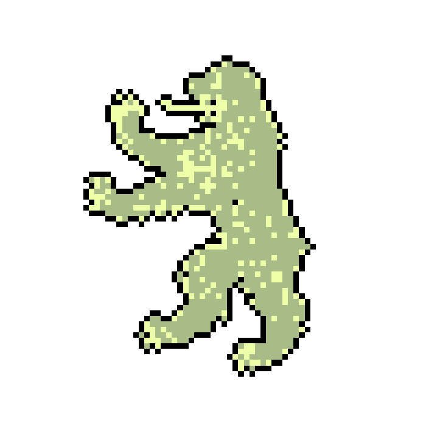

<link href="https://fonts.googleapis.com/css2?family=UnifrakturCook:wght@700" rel="stylesheet">
<link href="https://fonts.googleapis.com/css2?family=Rubik+Glitch" rel="stylesheet">
<link href="https://fonts.googleapis.com/css2?family=Pixelify+Sans" rel="stylesheet">

    
  
 L1F3 15 F13RY W17H 17S 834U7Y

   
  
   
 
  

  

  <a href="source/l1n3z.html">lines &#9998; linhas</a>
   
  <a href="source/7un3z.html">tunes &#9834; tons</a>
   
  <a href="source/7h0ugh7z.html">thoughts &#9967; pensamentos</a>
   
  

  

  
b34r
  
  

